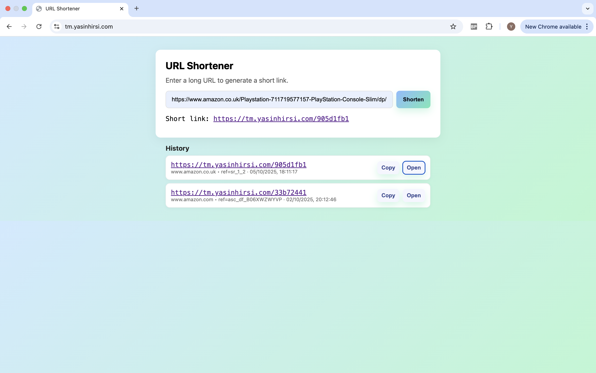
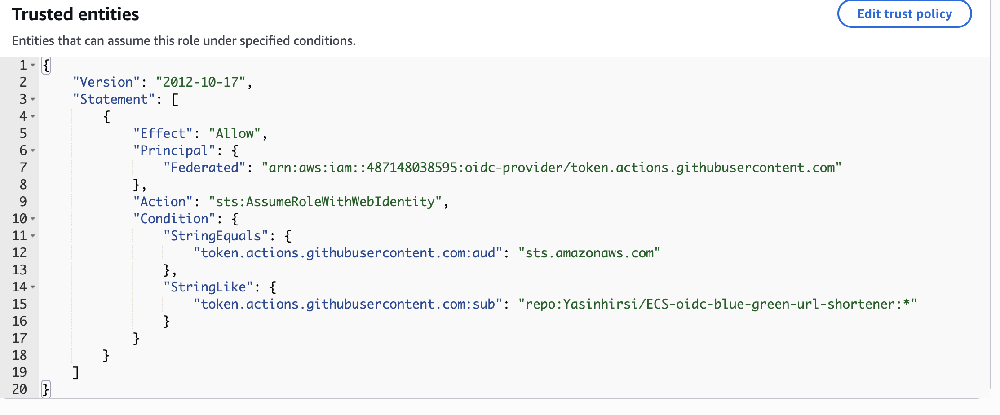
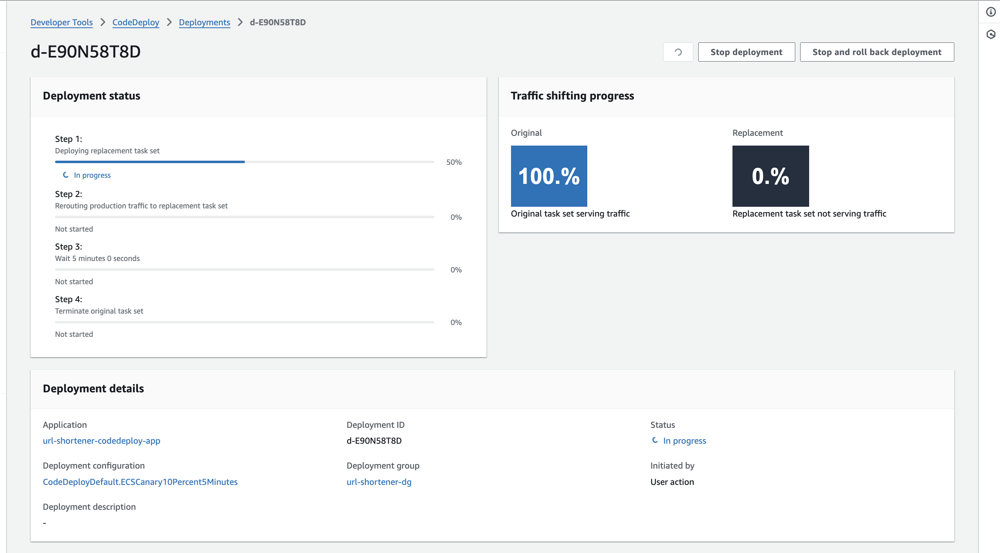
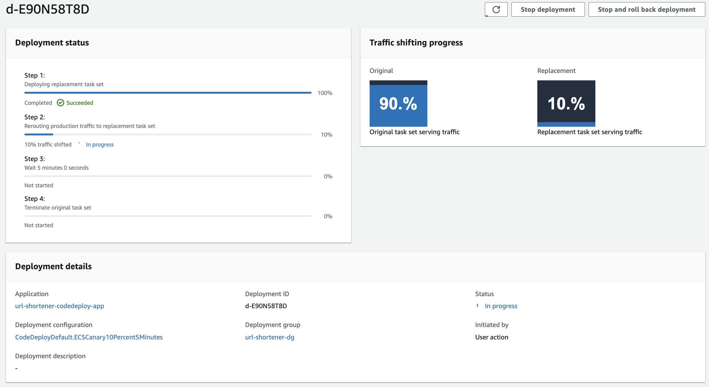
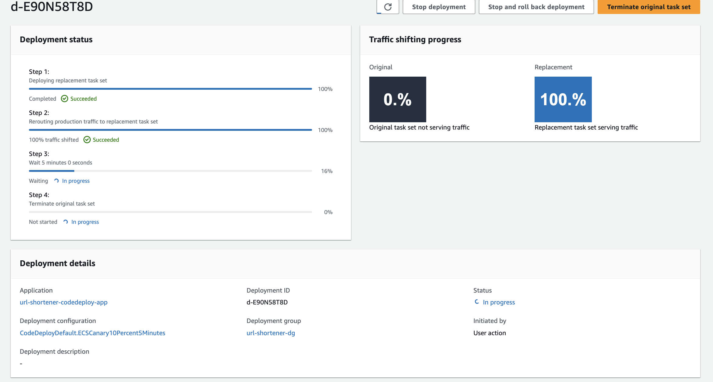
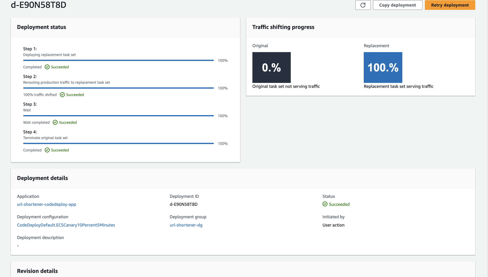
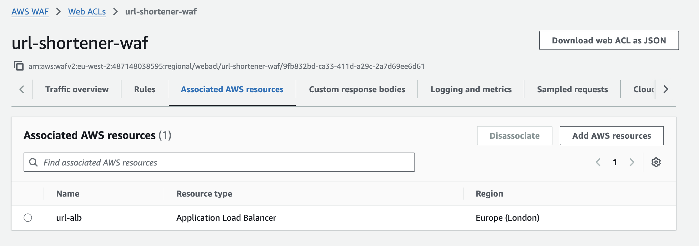
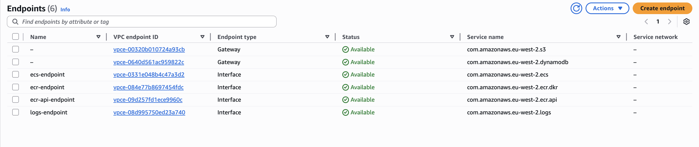

# URL Shortener on AWS ECS Fargate

## Overview

A production-grade URL shortening service deployed on AWS ECS Fargate with automated blue/green deployments and secure CI/CD.

**Highlights:**
- Blue/Green canary deployments with AWS CodeDeploy and ALB listeners
- OIDC integration: GitHub Actions assumes AWS IAM roles via STS, eliminating static credentials
- Network isolation with VPC Endpoints for DynamoDB, S3, ECR, ECS, and CloudWatch Logs
- Security posture: WAF fronting ALB, ACM for TLS, least-privilege IAM, and HTTPS enforcement
- Terraform-managed IaC for everything: ECS, networking, security, and deployment pipeline

## Architecture


## Live Demo



*Production URL shortener running on ECS Fargate with HTTPS and WAF protection.*

## Tech Stack

**App**: Python FastAPI + DynamoDB  
**Infra**: AWS ECS Fargate, ALB, Route 53, ACM, WAF, DynamoDB, VPC Endpoints  
**CI/CD**: GitHub Actions (Build → Push to ECR → Deploy via CodeDeploy)  
**Security**: OIDC federation, HTTPS, WAF, least-privilege IAM  

## How it Works

1. `git push` → GitHub Actions builds Docker image → pushes to ECR
2. Terraform plans and applies changes (manually or via workflow)
3. CodeDeploy runs canary deployment:
   - Spins up green ECS tasks
   - Health-checks them on test listener
   - Shifts 10% traffic for 5 minutes
   - Gradually shifts prod traffic blue → green or auto-rolls back
4. ALB + WAF serve traffic securely over HTTPS

## Architecture Decisions

**VPC Endpoints vs NAT Gateway**  
VPC Endpoints (~$21/month) eliminate NAT Gateway costs (~$64/month for 2 AZs). Trade-off: slight config complexity but significant cost savings.

**Blue/Green with Canary**  
10% canary for 5 minutes before full rollout. Trade-off: slower deployments (~6-7 min) but automatic rollback prevents bad releases.

**DynamoDB vs RDS**  
PAY_PER_REQUEST model. Trade-off: higher per-request cost but zero idle charges and serverless scaling aligns with Fargate.

## Evidence

### OIDC Trust Policy


### CodeDeploy Canary Deployment
   
 

### WAF Protection


### VPC Endpoints


## Local Deployment / Setup

### Terraform Configuration

In `terraform/variables.tf` adjust:
- `github_repo` → your GitHub repo name (used in OIDC trust policy)
- `region` → AWS region (default: `eu-west-2`)
- `certificate_arn` → your ACM certificate ARN for HTTPS

### Bootstrap

```bash
cd terraform
terraform init
terraform apply -target=module.oidc  # Create OIDC roles first
terraform apply                       # Deploy full infrastructure
```

### Teardown

```bash
terraform destroy -auto-approve
```

## Notes

- CodeDeploy controls image versions dynamically — no need to hardcode in Terraform
- GitHub secrets required: `AWS_ROLE_ARN` (CI role), `AWS_TF_ROLE_ARN` (Terraform role)
---


